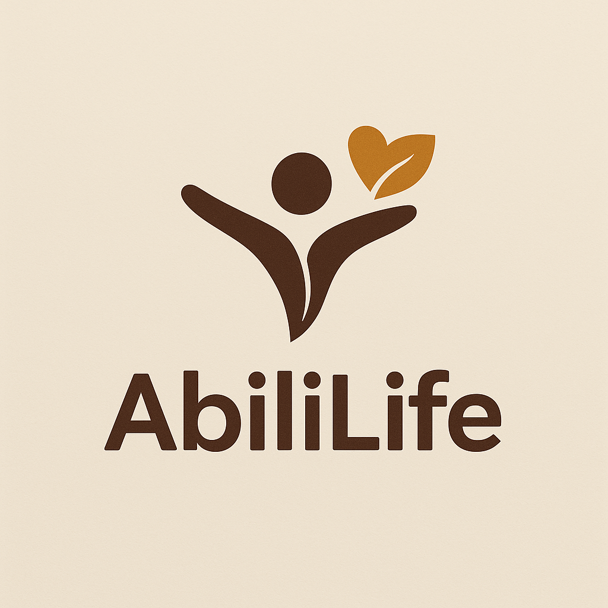
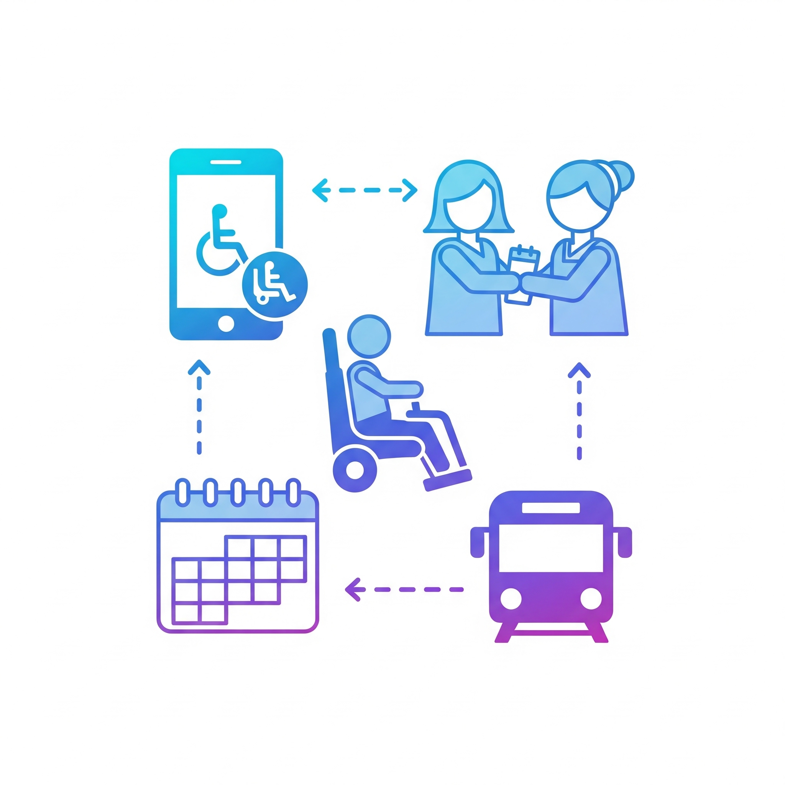

<p align="center">
   <a href="https://github.com/AbiliLife/AbiliLife-frontend">
      
   </a>
</p>

# AbiliLife Super App🌳

AbiliLife is a **modular super app** designed to empower Persons with Disabilities (PWDs) by providing an **integrated ecosystem** of services. Our vision is represented as a tree with five main branches:

```
            AbiliLife
            ───────
     ┌────────┬────────┬────────┬────────┬────────┐
     │Mobility│ Access │  Work  │  Care  │ Learn  │
     └────────┴────────┴────────┴────────┴────────┘
```

* **Mobility (this MVP | Ongoing beta):** Accessible ride-hailing and transport planning.
* **Access (future | beta):** Marketplace for assistive devices and inclusion resources.
* **Care (future | beta):** Healthcare, microinsurance, and caregiver coordination.
* **Work (our promise):** Job portal and financial inclusion for PWD professionals.
* **Learn (our promise):** Inclusive education and skills courses.

---

# 🧑🏾‍🦼‍➡️ AbiliLife Mobility Module (MVP)
<p align="center">
   
</p>

This repository hosts the **Mobility** slice of the AbiliLife ecosystem—an **Expo/React Native** front-end that enables:

* **Private Rides:** Wheelchair-accessible booking via Ace Mobility
* **Public Transport Info:** Routes & accessibility details
* **Scheduled Trips:** Plan rides in advance
* **Caregiver Mode:** Book on behalf of another user
* **Accessibility Preferences:** Ramps, assistive devices, sign language

---

## 📋 Table of Contents

* [Project Overview](#project-overview)
* [Tech Stack](#tech-stack)
* [Prerequisites](#prerequisites)
* [Getting Started](#getting-started)
* [Directory Structure](#directory-structure)
* [Core Features](#core-features)
* [Running the App](#running-the-app)
* [Contributing](#contributing)
* [License](#license)

---

## 🔍 Project Overview

AbiliLife Mobility delivers an accessible, on-demand transport experience for PWDs in East Africa:

1. **Book Private Rides:** Deep-link to Ace Mobility via WhatsApp for wheelchair-friendly vehicles.
2. **View Public Transit:** Map and schedule info for buses, matatus, and BRT with accessibility cues.
3. **Schedule in Advance:** Choose ASAP or pick a date/time slot.
4. **Enable Caregiver Mode:** Caregivers can request rides on behalf of PWDs.
5. **Set Preferences:** Toggle ramp/lift, assistive device support, or sign-language interpreter.

---

## 🛠 Tech Stack

* **Framework:** React Native with Expo
* **Navigation:** Expo Router
* **UI:** NativeWind (Tailwind CSS), React Native Paper, Gorhom Bottom Sheet
* **Maps & Location:** `expo-location`, `react-native-maps`
* **State:** React Context API
* **Communication:** WhatsApp deep links
* **Icons:** `@expo/vector-icons`
* **TypeScript:** Static typing

---

## 📋 Prerequisites

* **Node.js:** v16.x or later
* **Yarn** or **npm**
* **Expo CLI:** `npm install -g expo-cli`
* **Mobile Dev Tools** (optional): Android Studio / Xcode Simulator

---

## 🚀 Getting Started

1. **Clone the repo**

   ```bash
   git clone https://github.com/AbiliLife/AbiliLife-frontend.git
   cd AbiliLife-frontend
   ```

2. **Install dependencies**

   ```bash
   yarn install
   # or
   npm install
   ```


3. **Start Expo**

   ```bash
   npx expo start # For Expo Go App
   # or
   npx expo run:android # npx expo run:ios
   ```

4. **Run on device/emulator**

   * **iOS:** Press `i` or use Xcode
   * **Android:** Press `a` or use Android Studio

---

## 📂 Directory Structure

```
/app
├── access/          # Assistive tech marketplace (future)
├── auth/            # Sign-up, login, onboarding flows
├── care/            # Caregiver booking module
├── insurance/       # Insurance module (future)
├── learn/           # Learning module (future)
├── mobility/        # Mobility home & booking screens (this MVP)
├── onboarding/      # Welcome & tutorial screens
├── tabs/            # BottomTab navigator
└── work/            # Work & jobs module (future)

/components          # Shared UI components
/contexts            # React Context providers
/hooks               # Custom hooks
/services            # API and integration logic
/constants           # App-wide constants
/config              # Tailwind & router configs
/types               # TypeScript definitions
/assets              # Images, icons, fonts
```

---

## ⭐ Core Features

### 1. Quick Start & Onboarding
- Register using email or phone number with OTP verification **(onboarding flow in progress)**
- Guided onboarding experience with accessibility tips **(coming soon)**
- Set up your profile: name, disability type, and accessibility preferences **(feature under development)**

### 2. Mobility Dashboard
- One-tap access to Private Ride, Public Transport Info, and Schedule Ride
- Toggle Caregiver Mode for assisted bookings

### 3. Ride Booking Made Easy
- Interactive map with current location marker
- GPS autofill for pickup/dropoff
- Choose ASAP or schedule for later
- Accessibility options: ramp, assistive device, sign language
- Trip summary preview before booking
- Request ride via WhatsApp deep link
- Emergency hotline modal for urgent help

---

## ▶️ Running the App

To run the AbiliLife Mobility app locally:

1. **Start the development server:**

   ```bash
   npx expo start
   ```

2. **Open on your device:**
   - **Expo Go App:** Scan the QR code in your terminal or browser using the [Expo Go](https://expo.dev/client) app (iOS/Android).
   - **Emulator/Simulator:** Press `a` (Android) or `i` (iOS) in the terminal, or launch via Android Studio/Xcode.

3. **Hot Reloading:** Changes to your code will automatically reload the app.

**Troubleshooting:**
- If you encounter issues, try clearing the cache with `npx expo start -c`.
- Ensure your device and computer are on the same Wi-Fi network for QR code scanning.

For more details, see the [Expo documentation](https://docs.expo.dev/).


---

## 🤝 Contributing

We welcome your help! Please:

1. Fork the repo
2. Create a feature branch (`git checkout -b feat/awesome`)
3. Commit your changes (`git commit -m 'feat: awesome feature'`)
4. Push (`git push origin feat/awesome`)
5. Open a Pull Request

---

## 📄 License

Distributed under the AGPL-3.0 License. See [LICENSE](LICENSE) for details.

---

