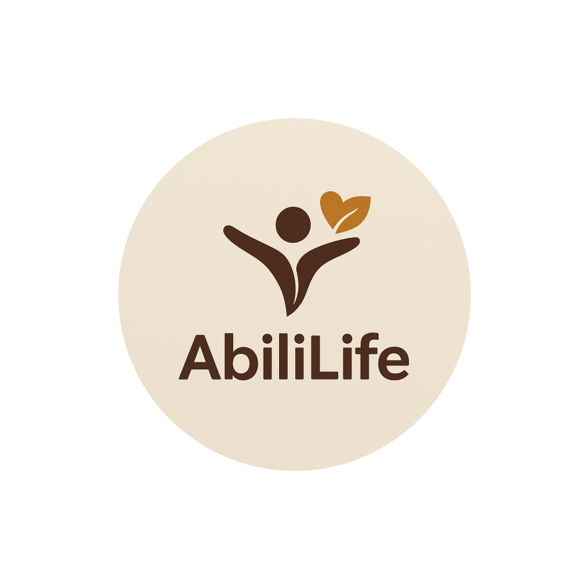

<p align="center">
   <a href="https://github.com/AbiliLife/AbiliLife-frontend">
      
   </a>
</p>

# AbiliLife Super App 🌳

[](https://github.com/AbiliLife/AbiliLife-frontend)
[](https://expo.dev/)
[](https://www.typescriptlang.org/)
[](LICENSE)

> **🚀 Now in Early Access Pilot Mode** - Ready for beta testing with select users and organizations

AbiliLife is a **modular super app** designed to empower Persons with Disabilities (PWDs) by providing an **integrated ecosystem** of accessible services across East Africa. Our vision is represented as a tree with five main branches:

| Branch    | Status   | Description                                      |
|-----------|----------|--------------------------------------------------|
| 🚗 Mobility | ✅ LIVE   | Accessible ride-hailing, transport, location     |
| 🛒 Access   | 🔮 SOON   | Marketplace for assistive devices & resources    |
| 🏥 Care     | 🔮 SOON   | Healthcare, microinsurance, caregiver support   |
| 💼 Work     | 🔮 SOON   | Job portal & financial inclusion                |
| 📚 Learn    | 🔮 SOON   | Inclusive education & skills development        |

* **🚗 Mobility (LIVE):** Accessible ride-hailing, transport planning, and location services
* **🛒 Access (COMING SOON):** Marketplace for assistive devices and inclusion resources  
* **🏥 Care (COMING SOON):** Healthcare, microinsurance, and caregiver coordination
* **💼 Work (FUTURE PROMISE):** Job portal and financial inclusion for PWD professionals
* **📚 Learn (FUTURE PROMISE):** Inclusive education and skills development courses

---

## 🎯 Current Status: Early Access Pilot

**AbiliLife v1.0.0** is now ready for **pilot testing** with our early access program. We've implemented:

### ✅ **Core Features Ready**
- 🔐 **Complete Authentication Flow** - Email/Phone signup with OTP verification
- 👥 **Comprehensive Onboarding** - Accessibility preferences, emergency contacts, care relationships
- 🚗 **Mobility Module** - Private ride booking, public transport info, scheduled trips
- 🗺️ **Advanced Location Services** - Dual provider support (OpenCage/Geoapify) with smart search
- ♿ **Accessibility-First Design** - Global FAB, screen reader support, high contrast modes
- 🎨 **Adaptive Theming** - Light/dark modes with accessibility considerations
- 📱 **Cross-Platform** - iOS & Android ready with Expo managed workflow

### 🧪 **Beta Features**
- 🤝 **Caregiver Mode** - Book rides on behalf of PWDs
- 🚨 **Emergency Services** - One-tap emergency ride hotline
- 🔍 **Smart Location Search** - Debounced, contextual location discovery
- 📊 **User Preferences** - Granular accessibility and service preferences

---

## 📱 Getting Started (Pilot Testing)

### 🔧 Prerequisites
- **Node.js** v16.x or later
- **Expo CLI** `npm install -g @expo/cli`
- **Mobile Device** or emulator (iOS/Android)

### 🚀 Quick Setup

1. **Clone & Install**
   ```bash
   git clone https://github.com/AbiliLife/AbiliLife-frontend.git
   cd AbiliLife-frontend
   npm install
   ```

2. **Environment Setup**
   ```bash
   cp .env.example .env
   # Add your API keys to .env file
   ```

3. **Launch Development Server**
   ```bash
   npm start
   # or npx expo start
   ```

4. **Test on Device**
   - **iOS:** Press `i` or scan QR with Expo Go
   - **Android:** Press `a` or scan QR with Expo Go

---

## 🏗️ Architecture & Features

### 📂 **Modular Structure**
```
/app
├── (auth)/              # 🔐 Authentication & OTP flows  
├── (onboarding)/        # 👋 User setup & preferences
├── (mobility)/          # 🚗 Transportation services (LIVE)
├── (access)/            # 🛒 Assistive tech marketplace (BETA)
├── (care)/              # 🏥 Healthcare & caregiving (COMING)
├── (work)/              # 💼 Employment services (COMING)
├── (learn)/             # 📚 Education platform (COMING)
└── (tabs)/              # 📱 Main navigation

/components              # 🧩 Reusable UI components
/services                # 🔌 API integrations & location services
/contexts                # 🔄 Global state management
/hooks                   # 🎣 Custom React hooks
```

### 🌟 **Key Innovations**

#### **🗺️ Intelligent Location Services**
- **Dual Provider Architecture** - Switch between OpenCage (dev) and Geoapify (prod)
- **Smart Search** - Debounced, contextual location discovery
- **Offline Resilience** - Graceful degradation with cached results

#### **♿ Accessibility-First Design**
- **Global Floating Action Button** - Draggable, always-accessible controls
- **Dynamic Text Scaling** - Responsive to system accessibility settings  
- **Screen Reader Optimized** - Comprehensive VoiceOver/TalkBack support
- **High Contrast Modes** - Adaptive color schemes for visual impairments

#### **🤝 Caregiver Integration**
- **Proxy Booking** - Caregivers can request services on behalf of PWDs
- **Emergency Contacts** - Integrated family/caregiver communication
- **Relationship Management** - Granular permissions and care coordination

---

## 🚗 Mobility Module (Live Features)

### **🎯 Core Functionality**
- **📍 Smart Pickup/Dropoff** - GPS autofill with location search
- **⏰ Flexible Scheduling** - Immediate or scheduled rides
- **♿ Accessibility Options** - Ramp access, assistive devices, sign language
- **💬 Multi-Channel Booking** - WhatsApp, SMS, and in-app requests
- **🚨 Emergency Support** - 24/7 hotline integration

### **🚌 Public Transport Integration**
- **Real-time Routes** - Accessible bus/matatu information
- **🗺️ Interactive Maps** - Wheelchair-friendly route planning
- **✈️ Airport Services** - Kenya Airways accessibility coordination

### **🎛️ Advanced Preferences**
- **Mobility Aids** - Wheelchair, walker, cane specifications
- **Communication** - Sign language interpreter requests
- **Transfer Assistance** - Personal care coordination

---

## 🔧 Technical Specifications

### **📱 Frontend Stack**
- **Framework:** React Native 0.75+ with Expo SDK 53
- **Navigation:** Expo Router with typed routes
- **UI Components:** Custom design system with React Native Paper
- **Maps:** react-native-maps with Google Maps integration  
- **State Management:** React Context API with Zustand stores
- **Type Safety:** TypeScript with strict configuration

### **🌐 Backend Integration**
- **Authentication:** JWT with refresh tokens
- **Real-time:** WebSocket connections for live updates
- **Location APIs:** OpenCage & Geoapify with failover
- **Communications:** WhatsApp Business API integration

### **♿ Accessibility Standards**
- **WCAG 2.1 AA Compliance** - Web Content Accessibility Guidelines
- **Platform Native** - iOS VoiceOver & Android TalkBack
- **Keyboard Navigation** - Full app navigation without touch
- **Color Contrast** - 4.5:1 minimum contrast ratios

---

## 🧪 Pilot Program

### **🎯 Target Users**
- **Individual PWDs** - Primary users testing mobility services
- **Caregivers & Families** - Testing proxy booking and coordination
- **Disability Organizations** - Institutional feedback and bulk testing
- **Transport Partners** - Ace Mobility and accessible vehicle operators

### **📊 Testing Focus Areas**
1. **User Onboarding** - First-time user experience and accessibility setup
2. **Mobility Booking** - End-to-end ride request and completion flows  
3. **Location Services** - Search accuracy and performance across Kenya
4. **Accessibility Features** - Screen reader, voice control, and adaptive interfaces
5. **Emergency Workflows** - Crisis support and caregiver notification systems

### **📝 Feedback Collection**
- **In-App Analytics** - User journey tracking and error monitoring
- **Accessibility Audits** - WCAG compliance testing
- **User Interviews** - Qualitative feedback sessions
- **Performance Metrics** - Load times, API response rates, crash reporting

---

## 🚀 Development Roadmap

### **📅 Current Sprint (August 2025)**
- ✅ **Pilot Mode Launch** - Early access program initiation
- ✅ **Location Services** - Dual provider implementation complete
- ✅ **Accessibility FAB** - Global floating controls deployed
- 🔄 **User Testing** - Feedback collection and iteration

### **🎯 Next Quarter (Sep-Nov 2025)**
- 🔨 **Access Module Beta** - Assistive technology marketplace
- 🔨 **Enhanced Onboarding** - Guided tutorials and accessibility setup
- 🔨 **Offline Capabilities** - Core functionality without internet
- 🔨 **Performance Optimization** - Bundle size reduction and caching

### **🌟 2026 Roadmap**
- 🚀 **Care Module** - Healthcare coordination and microinsurance
- 🚀 **Work Module** - Job matching and financial inclusion
- 🚀 **Learn Module** - Skills development and education platform
- 🚀 **API Platform** - Third-party integrations for partners

---

## 🤝 Contributing to the Pilot

We welcome contributions from developers, accessibility experts, and community members:

### **🛠️ Development Contributions**
1. **Fork the Repository** - Create your feature branch
2. **Follow Accessibility Guidelines** - Ensure WCAG 2.1 AA compliance
3. **Test on Multiple Devices** - iOS, Android, and assistive technologies
4. **Submit Pull Requests** - Include accessibility testing notes

### **🧪 Testing & Feedback**
- **Join our Early Access Program** - Contact us for pilot participation
- **Report Accessibility Issues** - Help us improve inclusive design
- **Share User Stories** - Real-world usage scenarios and improvements

### **📝 Code Style**
```typescript
// Use TypeScript strict mode
// Follow accessibility-first component design
// Include comprehensive error handling
// Document assistive technology considerations
```

---

## 📞 Support & Contact

### **🆘 For Pilot Participants**
- **Technical Support:** [GitHub Issues](https://github.com/AbiliLife/AbiliLife-frontend/issues)
- **Accessibility Questions:** abililifekenya@gmail.com

### **🤝 Partnership Inquiries**
- **Transport Partners:** info@acemobility.co.ke

### **🔗 Community**
- **Documentation:** **SOON**
- **Developer Portal:** **SOON**
- **Accessibility Guidelines:** **SOON**

---

## 📄 License & Attribution

**Licensed under AGPL-3.0** - See [LICENSE](LICENSE) for details.

### **🙏 Acknowledgments**
- **Accessibility Consultants** - Disabled persons organizations across Kenya
- **Transport Partners** - Ace Mobility and accessible vehicle operators
- **Technology Partners** - OpenCage, Geoapify, and mapping service providers
- **Community Contributors** - Beta testers and accessibility advocates

---

<p align="center">
  <strong>🌟 Building an Accessible Future for Everyone 🌟</strong><br>
  <em>Made with ❤️ for the disability community in East Africa</em>
</p>

---

**⚡ Ready to join our pilot program? Contact us at abililifekenya@gmail.com**

